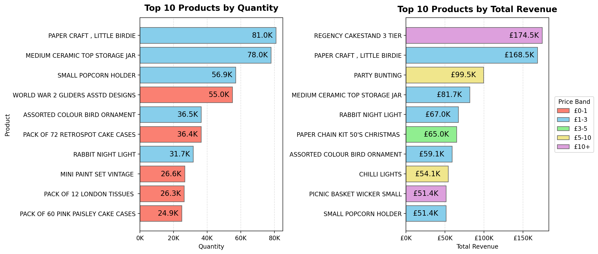
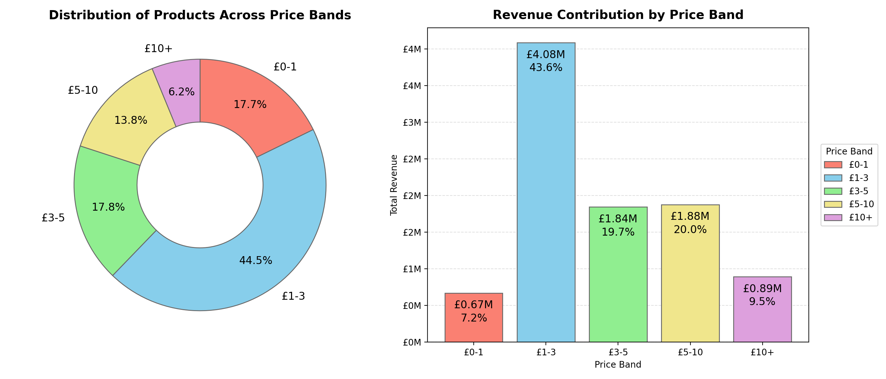
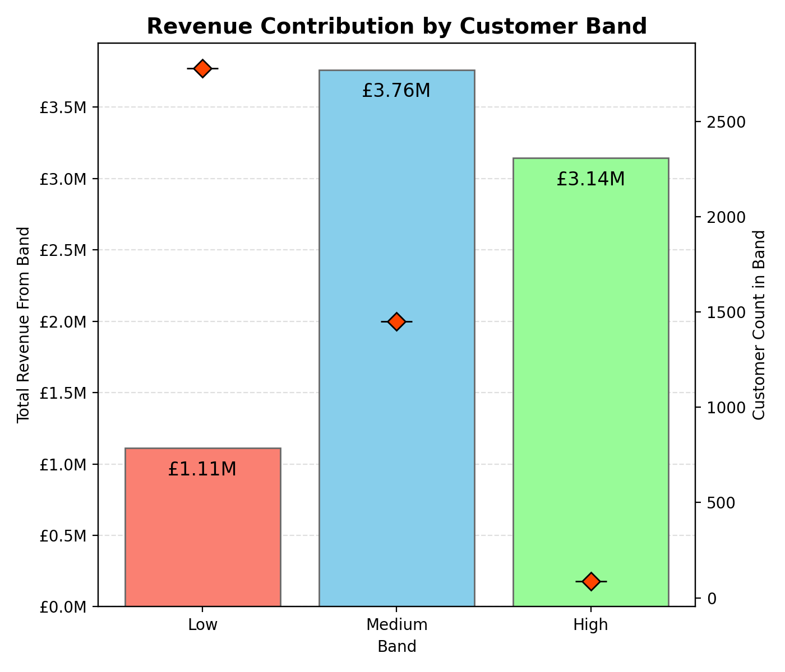
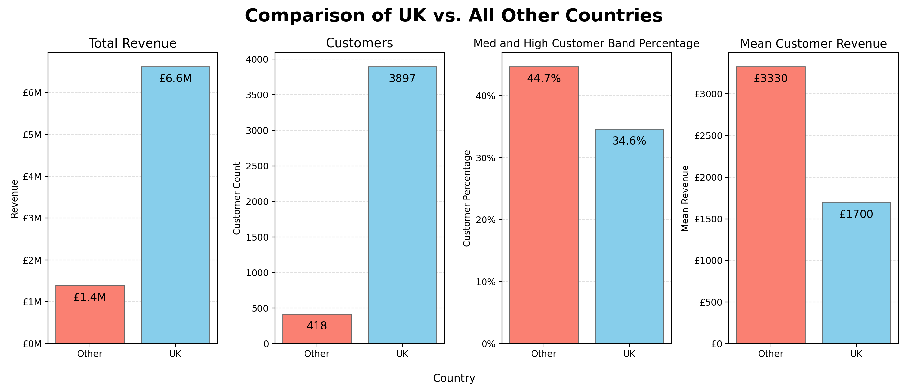

# Introduction

This is the third of four projects meant to showcase my knowledge of GitHub and various data science tools, such as Python. For this project, I worked with a dataset documenting over 500,000 transactions over the course of 1 year, for an online retail store based in the United Kingdom. This project will focus on cleaning, analyzing, and visualing the dataset using Python.

From this dataset, I wanted to know a few things:
- Which products are most successful?
- How do prices impact the success of a product?
- Does the Success of a product correlate with how often orders are cancelled?
- How much of overall revenue is contributed by low spending and high spending customers?
- What months of the year have the most revenue?
- How important is the customer base outside of the UK to revenue?


# Tools Used

- **Python**:
    - **Anoconda**: The data science oriented Python distribution used.
    - **Jupyter notebooks**: Used to separate the analysis process into multiple code blocks capable of being run separately.
    - **Pandas**: The Python library used for data manipulation, analysis, and cleaning.
    - **Matplotlib**: The Python library used for creating data visualizations.
- **Visual Studio Code**: Used to write and manage my Jupyter notebooks.
- **Git & GitHub**: Used to document and share my python code and analysis.


# Dataset


*Dataset sourced from the [UC Irvine Machine Learning Repository](https://archive.ics.uci.edu/dataset/352/online+retail)

Top 4 rows before cleaning:

| InvoiceNo | StockCode |                         Description | Quantity |    InvoiceDate | UnitPrice | CustomerID |        Country |
|----------:|----------:|------------------------------------:|---------:|---------------:|----------:|-----------:|---------------:|
|    536365 |    85123A |  WHITE HANGING HEART T-LIGHT HOLDER |        6 | 12/1/2010 8:26 |      2.55 |    17850.0 | United Kingdom |
|    536365 |     71053 |                 WHITE METAL LANTERN |        6 | 12/1/2010 8:26 |      3.39 |    17850.0 | United Kingdom |
|    536365 |    84406B |      CREAM CUPID HEARTS COAT HANGER |        8 | 12/1/2010 8:26 |      2.75 |    17850.0 | United Kingdom |
|    536365 |    84029G | KNITTED UNION FLAG HOT WATER BOTTLE |        6 | 12/1/2010 8:26 |      3.39 |    17850.0 | United Kingdom |

The dataset, as shown above is a single table with 8 columns. Each row documents a single order from a customers with the ID of the product orders, the amount ordered, the date it was ordered, the ID of the customer making the order, the unit price of item, and the country it was ordered from.

One thing of note regarding how the transactions are documented, is that not all rows are completed transactions. Some rows are cancelled orders, represented by a 'C' in fron of the InvoiceNo. Additionally, some others rows are documenting instances of damaged stock. Both the cancelled orders and damaged stock utilize negative quantity numbers. 

# Cleaning

When starting the cleaning process of the data I had a few goals in mind:
1. First, I wanted to remove all damage instances since there weren't enough to get meaningful analysis out of it. 
2. Second, I wanted to change how the cancelled orders to documented since the 'C' in the InvoiceNo would mess up grouping analysis. 
3. Third, I needed to ensure that the Date column was correctly recognized by Python as a date time datatype. 

```python
## Data loading
df = pd.read_csv('../dataset/online_retail.csv')

## Data cleaning
df['InvoiceDate'] = pd.to_datetime(df['InvoiceDate'])
df['CustomerID'] = df['CustomerID'].astype('Int64')

df['Cancelled'] = df['InvoiceNo'].str.startswith('C')
df['InvoiceNo'] = df['InvoiceNo'].mask(df['Cancelled'],df['InvoiceNo'].str[1:])

df = df[(df.StockCode.str.len() <= 6) & (df.StockCode.str.isnumeric())]
```

After importing the necessary libraries and functions, I started by reading in the dataset from the csv with `.read_csv()`. Once the dataframe is created I use `.to_datetime()` to ensure the InvoiceDate is recognized as a date. Next I add a new column called Cancelled which is a boolean column for whether the row was documneting a cancelled transaction. I then use that column with `.mask()` to remove the 'C' from the ID of cancelled transactions. Following that, I drop all the transactions for products not following the StockCode 6 number format since a small selection of items had longer stock codes from color variants or were not customer purchases.

```python
df['TotalPrice'] = df['Quantity'] * df['UnitPrice']

# Removed rows documenting product damage
df = df.drop(index=df[(df.Quantity < 0) & (~df.Cancelled)].index)

# Data separation by cancelled
df_full = df.copy()
df = df[~df.Cancelled].copy()
```
Next, I created a new column TotalPrice for the total cost of a transaction, this will make later analysis easier by doing the calculation here. Lastly, I drop all transactions representing damage instances with `.drop()` and create a separate dataframe without any cancelled transactions since only one of my analysis questions involves cancelled products.

Top 4 rows after cleaning:

| InvoiceNo | StockCode |                       Description | Quantity |         InvoiceDate | UnitPrice | CustomerID |        Country | Cancelled | TotalPrice |
|----------:|----------:|----------------------------------:|---------:|--------------------:|----------:|-----------:|---------------:|----------:|-----------:|
|    536365 |     71053 |               WHITE METAL LANTERN |        6 | 2010-12-01 08:26:00 |      3.39 |      17850 | United Kingdom |     False |      20.34 |
|    536365 |     22752 |      SET 7 BABUSHKA NESTING BOXES |        2 | 2010-12-01 08:26:00 |      7.65 |      17850 | United Kingdom |     False |      15.30 |
|    536365 |     21730 | GLASS STAR FROSTED T-LIGHT HOLDER |        6 | 2010-12-01 08:26:00 |      4.25 |      17850 | United Kingdom |     False |      25.50 |
|    536366 |     22633 |            HAND WARMER UNION JACK |        6 | 2010-12-01 08:28:00 |      1.85 |      17850 | United Kingdom |     False |      11.10 |
|

# Product Analysis 

Before starting analysis on the products, I needed to create a grouped dataset for the products sold. This grouped dataframe is used in most of the product analysis and has the following details:
- The total number of a product sold
- The total revenue generated by the product
- The average unit price
- The price band the product falls into

```python
## Dataset grouping
products_group = df.groupby('StockCode',observed=True)[['Quantity','TotalPrice', 'UnitPrice']].agg(
    Quantity=('Quantity','sum'),
    TotalRevenue=('TotalPrice','sum'),
    UnitPrice=('UnitPrice','mean')
)
product_details = df_full.drop_duplicates('StockCode')[['StockCode','Description']]
products_group = products_group.merge(product_details, on='StockCode')

## Product price band creation
products_group['PriceBand'] = pd.cut(
    products_group['UnitPrice'], 
    bins=[0,1,3,5,10,float('inf')], 
    labels=['£0-1', '£1-3', '£3-5', '£5-10', '£10+']
)
```
I start by using `.groupby()` to group by the StockCode and create the first 3 columns of Quantity, TotalRevenue, and UnitPrice. I then use `.cut()` to create a price band column which classifies the products based on what price range they fall into of (£0-1], (£1-3], (£3-5], (£5-10], and (£10+).


### Top Products


```python
### Setup
# Calculation
top_quantity = products_group.nlargest(10, 'Quantity')
top_totalprice = products_group.nlargest(10, 'TotalRevenue')

# Figure creation
fig, ax = plt.subplots(1, 2, figsize=(14,6))

colors = ['salmon', 'skyblue', 'lightgreen', 'khaki', 'plum']
```
Now that we have a grouped dataset with many  of the key insights for products, creating a bar plot with the top products by a column is relatively simple. Using the `.nlargest()` function I can filter the dataset for the 10 top products by the passed column, in this case Quantity and TotalRevenue. After getting the top products I use `.subplots()` to allow me to put the 2 planned bar charts next to eachother in the same single image.  

```python
## Quantity bar
bars1 = ax[0].barh(top_quantity['Description'], top_quantity['Quantity'], color=colors[0], edgecolor='dimgrey')

ax[0].invert_yaxis()
ax[0].grid(axis='x', linestyle='--', alpha=0.4)
ax[0].set_axisbelow(True)

ax[0].xaxis.set_major_formatter(FuncFormatter(lambda x, _: f'{x/1000:.0f}K'))
ax[0].bar_label(bars1, labels=[f'{x/1000:.1f}K' for x in top_quantity['Quantity']], padding=-40, fontsize='12')

ax[0].set_title('Top 10 Products by Quantity', fontsize=14, weight='bold', pad=12)
ax[0].set_xlabel('Quantity')
ax[0].set_ylabel('Product')
```
Using the top products filtered dataset, I create a horizonal bar with `.barh()` and hen implement a variety of visual customizations to make the charts easier to understand. I start by inverting the y axis with `.invert_yaxis()` to make the order of the bars more intuitive. Next, I turn on the grid lines with `.grid()`, but only for the axis that is needed and set them to be drawn below the bars with `.set_axisbelow()`. Then I use f string formatting with `.set_major_formatter()` and `.bar_label()` to add bar labels and customize the bar labels and axis ticks to use K to represent 1000, this makes understanding the numbers at a glance much easier. I then finish by adding titles and axis labels with `.set_title()`, `.set_xlabel()`, and `.set_ylabel()`. Since the process for creating the second bar plot is very similiar I won't showcase it here, the only notable differeneces are the labels.

```python
## Finish
fig.tight_layout()
plt.savefig('../assets/1_TopProducts.png', dpi=200)
```
Once I have both bar charts created I can finish by calling `.tight_layout()` to clean the visual placements and saving the figure with `.savefig()` to file so it can be displayed in the README.


### Product Price Band


```python
## Setup
# Calculations
price_grouped = products_group.groupby('PriceBand', observed=True)['TotalRevenue'].agg(
    TotalRevenue ='sum',
    BandCounts = 'count'
)

# Figure creation
fig, ax = plt.subplots(1, 2, figsize=(14,6))

colors = ['salmon', 'skyblue', 'lightgreen', 'khaki', 'plum']
```
Utilizing price band column we created earlier, I can group by the bands to get the total revenue of all products in the price bands in the count of how many uniqueproducts are in each of the bands.

```python
## Band distribution pie chart
ax[0].pie(
    x=price_grouped['BandCounts'],
    labels=price_grouped.index,
    startangle=90,
    counterclock=False,
    autopct='%1.1f%%',
    pctdistance=0.75,
    colors=colors,
    wedgeprops={'edgecolor': 'dimgrey', 'width': 0.5},
    textprops={'size':'large'}
)
ax[0].set_title('Distribution of Products Across Price Bands', weight='bold', fontsize=14,pad=10)

```
With the new price band data I create a pie chart with `.pie()` to visualize the breakdown of how many products are in each price band. I make sure to add percent labels with `autopct=` so the viewer can more easily compare the band distribution with the next total revenue bar chart.

```python
## Revenue distribution bar chart
bars1 = ax[1].bar(height=price_grouped['TotalRevenue'], x=price_grouped.index, color=colors, edgecolor='dimgrey')

ax[1].grid(axis='y', linestyle='--', alpha=0.4)
ax[1].set_axisbelow(True)

ax[1].yaxis.set_major_formatter(FuncFormatter(lambda y, _: f'£{y/1000000:.0f}M'))
ax[1].bar_label(bars1, labels=[f'£{y/1000000:.2f}M' for y in price_grouped['TotalRevenue']], padding=-20, fontsize='12')
ax[1].bar_label(bars1, labels=[f'{y*100:.1f}%' for y in price_grouped['TotalRevenue']/price_grouped['TotalRevenue'].sum()], padding=-35, fontsize='12')

ax[1].set_ylabel('Total Revenue')
ax[1].set_xlabel('Price Band')
ax[1].set_title('Revenue Contribution by Price Band', weight='bold', fontsize=14,pad=10)


## Finish
fig.tight_layout()
plt.savefig('../assets/2_PriceBandAnalysis.png', dpi=200)
```
The process for creating and finishing the second bar plot is similar to the already showcased bar plots. I add an additonal bar label for the percentage breakdown of revenue to help comparison of the two plots. 


### Cancellation Rate

```python
## Setup
# Calculation
cancelled_group = (df_full.groupby(['StockCode', 'Cancelled'], observed=True)['Quantity'].count().unstack(fill_value=0))
cancelled_group = cancelled_group.rename(columns={False: 'NotCancelled', True: 'Cancelled'})
cancelled_group['PercentCancelled'] = (cancelled_group['Cancelled'] / (cancelled_group['NotCancelled'] + cancelled_group['Cancelled']))
cancelled_group = cancelled_group[cancelled_group.Cancelled > 0]
cancelled_group = cancelled_group[(cancelled_group.Cancelled + cancelled_group.NotCancelled) > 10]

# Figure creation
fig, ax = plt.subplots(figsize=(7,6))
```


```python
## Cancellation percentage scatterplot
x = cancelled_group['Cancelled'] + cancelled_group['NotCancelled']
y = cancelled_group['PercentCancelled']

ax.scatter(x=x, y=y, alpha=0.5, s=8)

ax.set_xscale('log')
ax.set_ylim((0,0.25))

ax.grid(axis="both", linestyle='--', alpha=0.4)
ax.set_axisbelow(True)

ax.yaxis.set_major_formatter(FuncFormatter(lambda y, _: f'{y*100:.0f}%'))

ax.set_title('Cancellation Rates of Products by Orders Made', fontsize=14, weight='bold', pad=10)
ax.set_ylabel('Canellation Rate')
ax.set_xlabel('Orders Made (Logarithmic)')
```

```python
## Line of best fit
x_log = np.log10(x)

m, b = np.polyfit(x_log, y, 1)
x_line_log = np.linspace(x_log.min(), x_log.max(), 200)
y_line = m * x_line_log + b
plt.plot(10**x_line_log,y_line, color='orangered', linewidth=2, label='Logarithmic fit')
plt.legend()
```

```python
## Finish
r, p = pearsonr(x_log, y)
plt.text(0.02, 0.98, f"r = {r:.2f}\np = {p:.3g}", transform=plt.gca().transAxes, va='top', fontsize=12);

plt.tight_layout()
plt.savefig('../assets/3_CancellationRates.png', dpi=200)
```
### Product Analysis Takeaways


# Customer Analysis

### Customer Revenue Band



### Monthly Revenue


### Country Revenue


### Customer Analysis Takeaways

# Conclusion