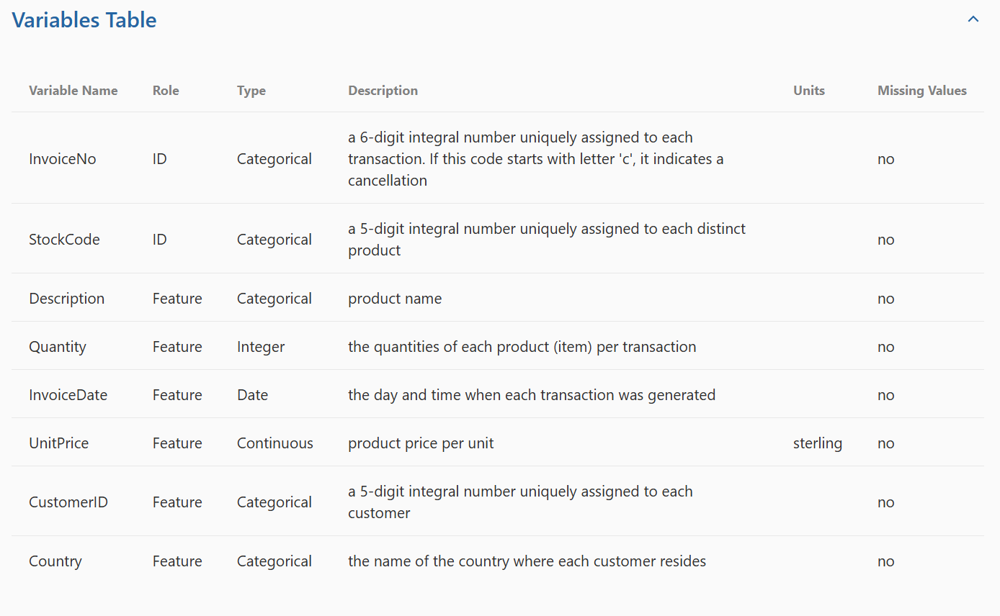
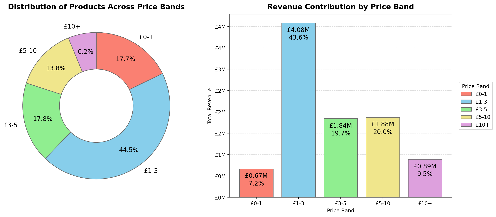
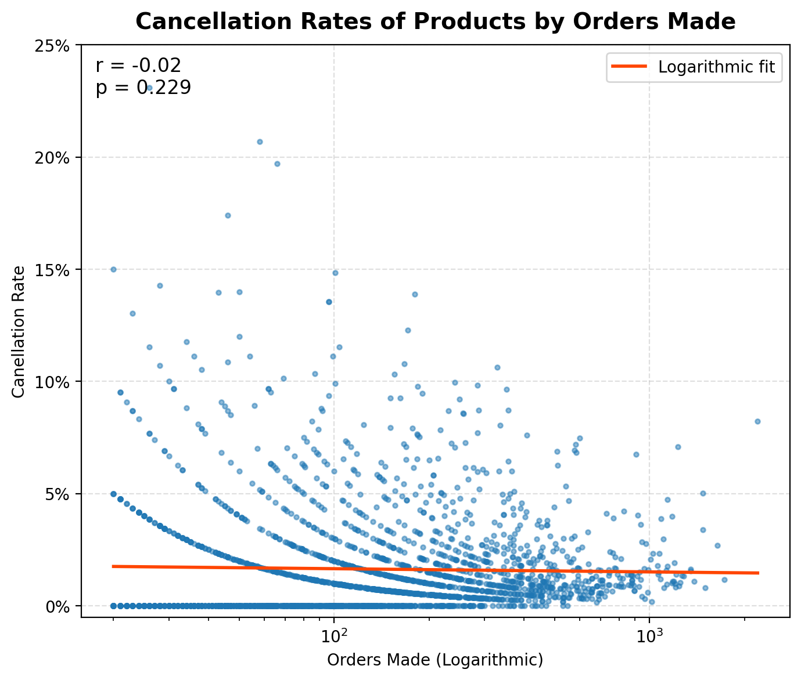
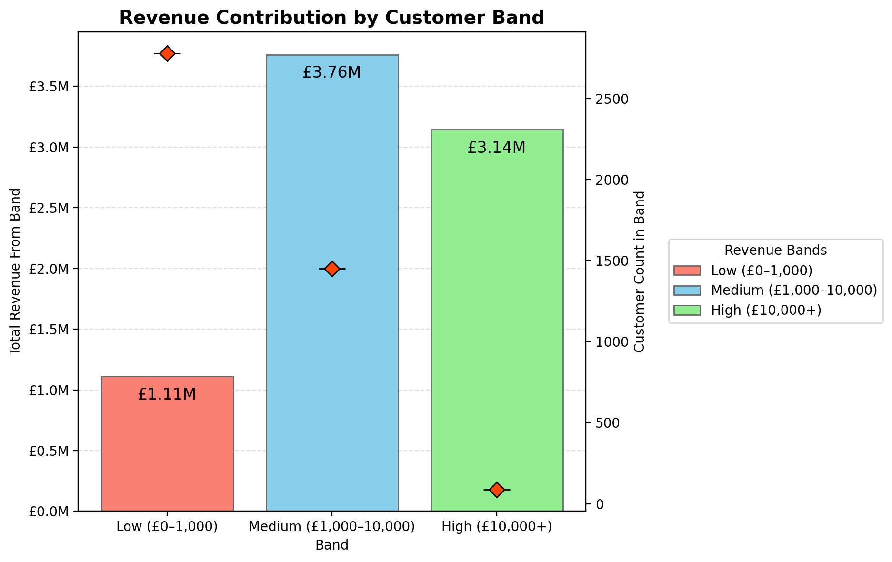
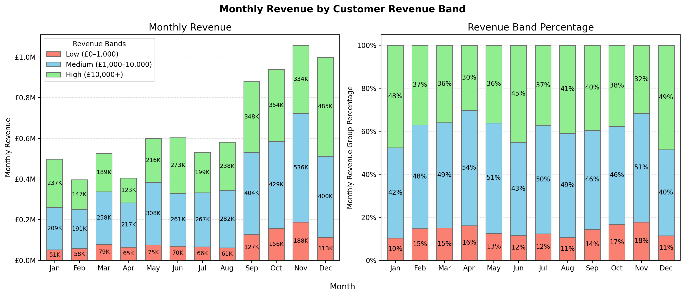
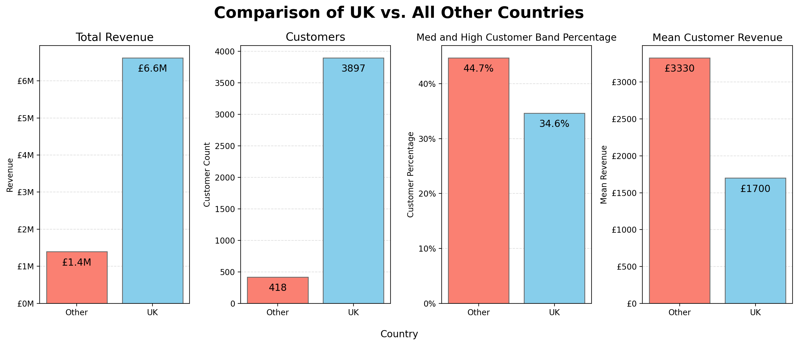

# Introduction

Welcome to my portfolio project on Python (Pandas & Matplotlib), this project is the third of four projects meant to showcase my knowledge of the most common and important tools in data science. For this project, I worked with a dataset documenting over 500,000 transactions over the course of 1 year for an online retail store based in the United Kingdom. This project focused on cleaning, analyzing, and visualizing the dataset using Python and the most common data science libraries of Pandas and Matplotlib.

From this dataset, I wanted to know a few things:
- Which products are most successful?
- How do prices impact the success of a product?
- Does the success of a product correlate with how often orders are cancelled?
- How much of overall revenue is contributed by low-spending and high-spending customers?
- How does revenue fluctuate throughout the year? Does it differ between low-spending and high-spending customers?
- How important is the customer base outside of the UK to revenue?


# Tools Used

- **Python**:
    - **Anoconda**: The data science-oriented Python distribution used.
    - **Jupyter notebooks**: Used to separate the analysis process into multiple code blocks capable of being run separately.
    - **Pandas**: The Python library used for data manipulation, analysis, and cleaning.
    - **Matplotlib**: The Python library used for creating data visualizations.
- **Visual Studio Code**: Used to write and manage my Jupyter notebooks.
- **Git & GitHub**: Used to document and share my Python code and analysis.


# Dataset
<p align="center">
  
</p>

*The dataset sourced from the [UC Irvine Machine Learning Repository](https://archive.ics.uci.edu/dataset/352/online+retail).*

Top 4 rows before cleaning:

| InvoiceNo | StockCode |                         Description | Quantity |    InvoiceDate | UnitPrice | CustomerID |        Country |
|----------:|----------:|------------------------------------:|---------:|---------------:|----------:|-----------:|---------------:|
|    536365 |    85123A |  WHITE HANGING HEART T-LIGHT HOLDER |        6 | 12/1/2010 8:26 |      2.55 |    17850.0 | United Kingdom |
|    536365 |     71053 |                 WHITE METAL LANTERN |        6 | 12/1/2010 8:26 |      3.39 |    17850.0 | United Kingdom |
|    536365 |    84406B |      CREAM CUPID HEARTS COAT HANGER |        8 | 12/1/2010 8:26 |      2.75 |    17850.0 | United Kingdom |
|    536365 |    84029G | KNITTED UNION FLAG HOT WATER BOTTLE |        6 | 12/1/2010 8:26 |      3.39 |    17850.0 | United Kingdom |

The dataset, as shown above, is a single table with 8 columns. Each row documents a single order from a customer, including the ID of the product ordered, the amount ordered, the date the product was ordered, the ID of the customer making the order, the unit price of the item, and the country the customer ordered from.

One thing of note regarding how the transactions are documented is that not all rows are completed transactions. Some rows are cancelled orders, represented by a 'C' in front of the InvoiceNo. Additionally, some other rows document instances of damaged stock. Both cancelled orders and damaged stock utilize negative quantity numbers. 

# Cleaning

All code can be located in the [analysis](analysis) folder.

When starting the cleaning process of the data, I had a few goals in mind:
1. First, I wanted to remove all damage instances since there weren't enough to get meaningful analysis out of it. 
2. Second, I wanted to change how the cancelled orders were documented since the 'C' in the InvoiceNo would mess with other analysis. 
3. Third, I needed to ensure that the Date column was correctly recognized by Python as a datetime datatype. 

```python
## Imports
import numpy as np
import pandas as pd

import matplotlib.pyplot as plt
from matplotlib.ticker import FuncFormatter
from matplotlib.patches import Patch

from scipy.stats import pearsonr

## Plotting Constants
COLORS = ['salmon', 'skyblue', 'lightgreen', 'khaki', 'plum']
EDGECOLOR = 'dimgrey'

## Data loading
df = pd.read_csv('../dataset/online_retail.csv')
```
Before cleaning the data I first needed to do my imports, constant initialization, and data loading.

```python
## Data cleaning
df['InvoiceDate'] = pd.to_datetime(df['InvoiceDate'])
df['CustomerID'] = df['CustomerID'].astype('Int64')

df['Cancelled'] = df['InvoiceNo'].str.startswith('C')
df['InvoiceNo'] = df['InvoiceNo'].mask(df['Cancelled'],df['InvoiceNo'].str[1:])

df = df[(df.StockCode.str.len() <= 6) & (df.StockCode.str.isnumeric())]
```

After importing the necessary libraries and functions, I started by reading in the dataset from the CSV with `.read_csv()`. Once the dataframe is created, I used `.to_datetime()` to ensure the InvoiceDate is recognized as datetime data. Next, I added a new column called "Cancelled," which is a Boolean column for whether the row was documenting a cancelled transaction. I then used that column with `.mask()` to remove the 'C' from the ID of cancelled transactions. Following that, I dropped all the transactions for products not following the StockCode 6 number format since a small selection of products had longer stock codes from color variants or were not customer purchases.


```python
df['TotalPrice'] = df['Quantity'] * df['UnitPrice']

# Removed rows documenting product damage
df = df.drop(index=df[(df.Quantity < 0) & (~df.Cancelled)].index)
df['Quantity'] = abs(df['Quantity'])

# Data separation by cancelled
df_full = df.copy()
df = df[~df.Cancelled].copy()
```
Next, I created a new column, TotalPrice, for the total cost of a transaction. This will make later analysis easier by doing the calculation here. Lastly, I dropped all transactions representing damage instances with `.drop()` and created a separate dataframe without any cancelled transactions since only one of my analysis questions involves cancelled products.

Top 4 rows after cleaning:

| InvoiceNo | StockCode |                       Description | Quantity |         InvoiceDate | UnitPrice | CustomerID |        Country | Cancelled | TotalPrice |
|----------:|----------:|----------------------------------:|---------:|--------------------:|----------:|-----------:|---------------:|----------:|-----------:|
|    536365 |     71053 |               WHITE METAL LANTERN |        6 | 2010-12-01 08:26:00 |      3.39 |      17850 | United Kingdom |     False |      20.34 |
|    536365 |     22752 |      SET 7 BABUSHKA NESTING BOXES |        2 | 2010-12-01 08:26:00 |      7.65 |      17850 | United Kingdom |     False |      15.30 |
|    536365 |     21730 | GLASS STAR FROSTED T-LIGHT HOLDER |        6 | 2010-12-01 08:26:00 |      4.25 |      17850 | United Kingdom |     False |      25.50 |
|    536366 |     22633 |            HAND WARMER UNION JACK |        6 | 2010-12-01 08:28:00 |      1.85 |      17850 | United Kingdom |     False |      11.10 |
|

# Product Analysis Code

Before starting analysis on the products, I needed to create a grouped dataframe for the products sold. This dataframe is used in most of the product analysis and has the following columns:

- The product ID
- The total quantity of a product sold
- The total revenue generated by the product
- The average unit price
- The price band the product falls into

```python
## Dataset grouping
products_group = df.groupby('StockCode',observed=True)[['Quantity','TotalPrice', 'UnitPrice']].agg(
    Quantity=('Quantity','sum'),
    TotalRevenue=('TotalPrice','sum'),
    UnitPrice=('UnitPrice','mean')
)
product_details = df_full.drop_duplicates('StockCode')[['StockCode','Description']]
products_group = products_group.merge(product_details, on='StockCode')

## Product price band creation
bands = ['£0-1', '£1-3', '£3-5', '£5-10', '£10+']
color_map = dict(zip(bands, COLORS))

products_group['PriceBand'] = pd.cut(
    products_group['UnitPrice'], 
    bins=[0,1,3,5,10,float('inf')], 
    labels=bands
)
```
I started by using `.groupby()` to group by the StockCode and create the first 3 columns of Quantity, TotalRevenue, and UnitPrice. I then used `.cut()` to create a price band column, which classifies the products based on what price range they fall into: (£0-1], (£1-3], (£3-5], (£5-10], and (£10+). I also created a color map for the color bands, which will be used later to ensure consistent coloring for the bands in charts. The only place where the color map was necessary was for the first chart. In the other charts, the natural ordering of the bands allowed me to simplify the coloring by just using the constant COLORS list I created at the start.


### Top Products
<p align="center">
  
</p>

```python
### Setup
# Calculation
top_quantity = products_group.nlargest(10, 'Quantity')
top_totalprice = products_group.nlargest(10, 'TotalRevenue')

# Figure creation
fig, ax = plt.subplots(1, 2, figsize=(14,6))

```
For the first part of the product analysis I wanted to create bar charts to visualize the top 10 products by quantity sold and revenue generated. Since I have a grouped dataframe, creating the bar plot is relatively simple. Using the `.nlargest()` function, I can filter the dataframe for the 10 top products by the passed column, in this case Quantity and TotalRevenue. After getting the top products, I used `.subplots()` to allow me to put the 2 bar charts next to each other in the same single image.

```python
## Quantity bar
bars1 = ax[0].barh(top_quantity['Description'], top_quantity['Quantity'], color=top_quantity['PriceBand'].map(color_map), edgecolor=EDGECOLOR)

ax[0].invert_yaxis()
ax[0].grid(axis='x', linestyle='--', alpha=0.4)
ax[0].set_axisbelow(True)

ax[0].xaxis.set_major_formatter(FuncFormatter(lambda x, _: f'{x/1000:.0f}K'))
ax[0].bar_label(bars1, labels=[f'{x/1000:.1f}K' for x in top_quantity['Quantity']], padding=-40, fontsize='12')

ax[0].set_title('Top 10 Products by Quantity', fontsize=14, weight='bold', pad=12)
ax[0].set_xlabel('Quantity')
ax[0].set_ylabel('Product')
```

Using the top products filtered datframe, I created a horizontal bar with `.barh()` using the color map to set the bar colors. Following the bar creation, there were still many customizations needed to be done to make the chart more intuitive and insightful. I started by inverting the y-axis with `.invert_yaxis()` to make the order of the bars more intuitive. Next, I turned on the grid lines with `.grid()`, but only for the x-axis, and set the grid lines to be drawn below the bars with `.set_axisbelow()`. Then, I used f-string formatting with `.set_major_formatter()` and `.bar_label()` to add bar labels and customize those labels along with the axis ticks to use K to represent 1000. This makes understanding the numbers at a glance much easier. I then finished by adding titles and axis labels with `.set_title()`, `.set_xlabel()`, and `.set_ylabel()`. Since the process for creating the second bar plot is very similar, I won't showcase it here. The only notable differences are the labels. In later parts of this project, I will skip explaining and showcasing code that is similar to already shown and explained code.

```python
legend_handles = [Patch(facecolor=color, edgecolor='dimgrey', label=band) for band, color in color_map.items()]
ax[1].legend(handles=legend_handles, title='Price Band', bbox_to_anchor=(1.02, 0.5), loc='center left')
```
To create the legend I used `Patch()` with the color map to create the legend handles. Since neither of the bar plots had all the bands in their data, manually creating the legend like this was necessary.

```python
## Finish
fig.tight_layout()
plt.savefig('../assets/1_TopProducts.png', dpi=200, bbox_inches='tight')
```
Once I had both bar charts and the legend created, I finished by calling `.tight_layout()` to clean the visual placements and saved the figure to a file with with `.savefig()` so it can be displayed in the README.


### Product Price Band
<p align="center">
  
</p>

```python
## Setup
# Calculations
price_grouped = products_group.groupby('PriceBand', observed=True)['TotalRevenue'].agg(
    TotalRevenue ='sum',
    BandCounts = 'count'
)

# Figure creation
fig, ax = plt.subplots(1, 2, figsize=(14,6))

colors = ['salmon', 'skyblue', 'lightgreen', 'khaki', 'plum']
```
For the second part of the analysis, I wanted to create a pie chart and bar chart to visualize the breakdown of unique products and total revenue by the price bands. Utilizing the price band column created earlier, I could group by the bands to get the total revenue of all products in the price bands and the counts of how many unique products are in each of the bands.

```python
## Band distribution pie chart
ax[0].pie(
    x=price_grouped['BandCounts'],
    labels=price_grouped.index,
    startangle=90,
    counterclock=False,
    autopct='%1.1f%%',
    pctdistance=0.75,
    colors=COLORS,
    wedgeprops={'edgecolor':EDGECOLOR, 'width':0.5},
    textprops={'size':'large'}
)
ax[0].set_title('Distribution of Products Across Price Bands', weight='bold', fontsize=14,pad=10)

```
With the new price band data, I created a pie chart with `.pie()` to visualize the breakdown of how many products are in each price band. I made sure to add percent labels with `autopct=` so the viewer can more easily compare the band distribution with the next total revenue bar chart.

The process for creating and finishing the second bar plot is similar to the already showcased bar plots.


### Cancellation Rate
<p align="center">
  
</p>

```python
## Setup
# Calculation
cancelled_group = (df_full.groupby(['StockCode', 'Cancelled'], observed=True)['StockCode'].count().unstack(fill_value=0))
cancelled_group = cancelled_group.rename(columns={False: 'NotCancelled', True: 'Cancelled'})
cancelled_group = cancelled_group[(cancelled_group.Cancelled + cancelled_group.NotCancelled) >= 20]
cancelled_group['PercentCancelled'] = (cancelled_group['Cancelled'] / (cancelled_group['NotCancelled'] + cancelled_group['Cancelled']))


# Figure creation
fig, ax = plt.subplots(figsize=(7,6))
```
For the last part of the product analysis, I wanted to plot the cancellation rate of a product versus the total sales made to see if there is a correlation between the two values. To start, I needed the cancellation rates. I calculated this by grouping the full dataframe (the one previously worked with had cancelled orders excluded) by StockCode and Cancelled, counting the number of orders cancelled and not cancelled. I then unstacked it with `.unstack()` so I had a dataframe with rows for each product and 2 columns for the cancelled counts and not cancelled counts. After filtering to only products with sufficient data (>= 20 orders), I calculated the percent cancelled and saved it to a new column.

```python
## Cancellation percentage scatterplot
x = cancelled_group['Cancelled'] + cancelled_group['NotCancelled']
y = cancelled_group['PercentCancelled']

ax.scatter(x=x, y=y, alpha=0.5, s=8)

ax.set_xscale('log')
ax.set_ylim((0.005,0.25))

ax.grid(axis="both", linestyle='--', alpha=0.4)
ax.set_axisbelow(True)

ax.yaxis.set_major_formatter(FuncFormatter(lambda y, _: f'{y*100:.0f}%'))

ax.set_title('Cancellation Rates of Products by Orders Made', fontsize=14, weight='bold', pad=10)
ax.set_ylabel('Canellation Rate')
ax.set_xlabel('Orders Made (Logarithmic)')
```
Now that I had the two values needed of orders made and cancellation percentage, I could create the scatterplot with `.scatter()`. Additionally, since there was a large variety in the number of orders for each product I set the x scale to logarithmic with `.set_xscale()`.

```python
## Line of best fit
x_log = np.log10(x)

m, b = np.polyfit(x_log, y, 1)
x_line_log = np.linspace(x_log.min(), x_log.max(), 200)
y_line = m * x_line_log + b
plt.plot(10**x_line_log,y_line, color='orangered', linewidth=2, label='Logarithmic fit')
plt.legend()
```
Using the log of the x values, I created a line of best fit for the chart with `.polyfit()` and plotted the line with `.plot()`.

```python
## Finish
r, p = pearsonr(x_log, y)
plt.text(0.02, 0.98, f"r = {r:.2f}\np = {p:.3g}", transform=plt.gca().transAxes, va='top', fontsize=12);

plt.tight_layout()
plt.savefig('../assets/3_CancellationRates.png', dpi=200, bbox_inches='tight')
```
To finish the plot I wanted to some statistical analysis to see if there is a statistically significant relationship. I used `pearsonr()` to get the r and p values and put them onto the chart with `.text()`.


# Product Analysis Takeaways

### Top Products & Price Band
From the two bar charts of the top 10 products by quantity sold and total revenue, we can notice a couple patterns. One pattern is that the top products by quantity sold are all from the two lowest price bands, showing that lower-priced products sell better. Another pattern is that across the two charts, the £1-3 band is the top performer, with it having both the top 3 products by quantity sold and half of both the top 10 by quantity and revenue. Interestingly, there isn't a single product from the lowest price band in the top 10 by revenue, showing that although they sell well, that doesn't make up for low revenue generated per sale.

Looking at the second chart, we can get some more insights regarding the overall performances of the different price bands. Products in the £1-3 band by far are the most popular, with 44.5% of all unique products offered having a price in that band. The most interesting insights, however, come from comparing the distribution of products by band to the distribution of revenue by band. Products in the £1-3 and £3-5 price bands have a roughly equal representation in the product distribution and revenue distribution. Products in the £0-1 price band make up 17.7% of unique products falling into that band make up less than half of that percentage of overall revenue. Conversely, the revenue of products in the £5-10 and £10+ bands outperforms their percentage of the unique products within their band. 

From these two charts, it is clear that low-price products within the £0-1 band are much less profitable compared to products of higher prices. Products within that band make many sales but bring in very little revenue compared to the percentage of unique products within the band. Conversely, products in the £1-3 band make up the core of the business with the majority of revenue and unique products within the band. Lastly, products of the higher price bands outperform the lower bands with regard to revenue generated per unique product listed. I would recommend a shift in focus away from lower-priced products under £1 and toward the more revenue-generating higher-priced products.

### Cancellation Rates

Based on the graph of cancellation rates and the p-value being greater than 0.05, there is no statistically significant relationship between cancellation rates and the total number of orders made for a product. This tells us that products that have been ordered more do not have statistically different cancellation rates. I wanted to test this to see if more successfull items were possibly more trusted, resulting in less cancellations but that has been proven false.

### Questions and Answers
To answer the questions posed at the start:

- Which products are most successful?

    - The most successful products are those within the £1-3 price band, with those products making up the largest portion of unique offered products and revenue.

- How do prices impact the success of a product?

    - The products in the lowest price band of £0-1 sell well but make up a small portion of the overall revenue. On the other hand, products in the highest price bands of £5-10 and £10+ sell less but make more revenue relative to the unique number of products in the price bands. 

- Does the success of a product correlate with how often orders are cancelled?

    - No, the success of a product does not correlate with how often orders are cancelled.

# Customer Analysis Code

Similar to the product analysis, I needed to create a grouped dataframe for the customers to the business. This grouped dataframe is used in most of the customer analysis and has the following details:
 
- The customer ID
- The Country the customer is based in
- The total revenue generated by the customer
- The revenue band that customer falls into

```python
## Dataset grouping
df = df_full[~df_full.Cancelled].copy()
customer_info = df.drop_duplicates('CustomerID')
customers_group = df.groupby('CustomerID', observed=True)['TotalPrice'].agg(TotalRevenue='sum').sort_values(by='TotalRevenue', ascending=False)
customers_group = customers_group.merge(customer_info[['CustomerID', 'Country']], on='CustomerID', how='left')

## Customer revenue band creation
bands = ['Low (£0–1,000)', 'Medium (£1,000–10,000)', 'High (£10,000+)']

customers_group['RevenueBand'] = pd.cut(
    customers_group['TotalRevenue'], 
    bins=[0,1000,10000,float('inf')], 
    labels=bands
)
df = df.merge(customers_group[['CustomerID', 'RevenueBand']], on='CustomerID', how='left')
```
The process for creating the grouped customer dataframe is the same as for the product grouped dataframe. I Utilized `.groupby()` to get the total revenue and `.cut()` to create the bands. Additionally, I used `.merge()` to add the revenue bands to the ungrouped dataframe for the later monthly revenue analysis.

### Customer Revenue Band
<p align="center">
  
</p>

```python
### Customer Revenue Band Analysis

## Setup
# Calculation
RevenueBand_counts = customers_group['RevenueBand'].value_counts()
RevenueBand_sums = customers_group.groupby('RevenueBand', observed=True)['TotalRevenue'].sum()

# Figure creation
fig, ax1 = plt.subplots(figsize=(7,6))
```
For the first part of the customer analysis I wanted to compare the total revenue generated by customers of each band and how many customers fall into each band. To achieve this, I created a graph with two vertical axes, one for the revenue (bars) and a second for the customer count (points). To get the customer counts, I used `.value_counts()` to get how many customers are in each band and used `.groupby()` to get the total revenue for each band.

```python
## Customer count point
ax2 = ax1.twinx()

ax2.plot(RevenueBand_counts, marker='_', color='orangered', linestyle='None', markeredgecolor='black', ms=20)
ax2.plot(RevenueBand_counts, marker='D', color='orangered', linestyle='None', markeredgecolor='black', ms=8)

labels1 =  [f'£{x/1000000:.2f}M' for x in RevenueBand_sums]
ax2.set_ylabel('Customer Count in Band')
```
The revenue bars were created similarly to the previously shown bar charts. The customer counts were added using `twinx()` to create a secondary vertical axis on which I used `.plot()` to plot the customer counts. To remove the connecting lines between points, I set `linestyle=` to none and I plotted the same points twice to combine the diamond point shape with the straight line point shape to make it more visible.

```python
## Finish
fig.legend(bars1, bands, title='Revenue Bands', bbox_to_anchor=(1, 0.5), loc='center left')

fig.tight_layout()
plt.savefig('../assets/4_CustomerRevenueByBand.png', dpi=200, bbox_inches='tight')
```
I finish by adding a legend outside of the chart and saving the figure.

### Monthly Revenue
<p align="center">
  
</p>

```python
## Setup
# Calculation
month_revenue = df.groupby([df.InvoiceDate.dt.month,'RevenueBand'], observed=True)['TotalPrice'].sum().unstack(fill_value=0)
month_revenue_percent = month_revenue.div(month_revenue.sum(axis=1), axis=0)

# Figure Creation
fig, ax = plt.subplots(1,2, figsize=(14,6))

months = ['Jan', 'Feb', 'Mar', 'Apr', 'May', 'Jun', 'Jul', 'Aug', 'Sep', 'Oct', 'Nov', 'Dec']
```
For the second part of the customer analysis I wanted to explore how revenue fluctuates throughout the year and whether those trends are the same for the different customer bands. To accomplish this, I took the original dataframe, which I had added the customer revenue bands to, and grouped it by the month of the order, gotten with `dt.month` and the revenue band. Once unstacked, I had a new dataframe with a row for each month and a column for the total revenue by each band in that month. I then calculated the percentages with `.div()` and created a list of month names to use as labels since `dt.month` uses numbers instead of names. The alternative was using `dt.month` first and manually ordering it later since it would naturally order the months alphabetically.

```python
## Monthly revenue bar
month_revenue.plot(ax=ax[0], kind='bar', stacked=True, color=COLORS, edgecolor=EDGECOLOR, width=0.65)

ax[0].grid(axis='y', linestyle='--', alpha=0.4)
ax[0].set_axisbelow(True)

ax[0].yaxis.set_major_formatter(FuncFormatter(lambda x, _: f'£{x/1000000:.1f}M'))
ax[0].set_xticklabels(months)
ax[0].tick_params(rotation=0)

for container in ax[0].containers:
    ax[0].bar_label(container, fmt=lambda x: f'{x/1000:.0f}K', label_type='center', fontsize=8.5, color='black')

fig.suptitle('Monthly Revenue by Customer Revenue Band', fontsize=14, fontweight='bold')
fig.supxlabel('Month')
ax[0].set_title('Monthly Revenue', fontsize=14)
ax[0].set_xlabel('')
ax[0].set_ylabel('Monthly Revenue')
ax[0].legend(title='Revenue Bands') 
```
In order to create the stacked bar chart, I used `.plot()` with the `kind=` set to 'bar' and `stacked=` set to True. Now with the stacked bars, I needed to make some visual customizations. I changed the tick labels to use the month names instead of numbers with `.set_xticklabels()` and changed the rotation with `.tick_params()`. To add bar labels to each individual bar, I loop through the containers in the axis and  call `.bar_label()` with the container. I finish by adding a super title and super x-axis label with `.suptitle()` and `.supxlabel()`. The process for creating the second stacked bar chart is very similar, instead using the percentage data.

### Country Revenue
<p align="center">
  
</p>

```python
## Setup
# Calculations
country_group = customers_group.groupby('Country', observed=True)['TotalRevenue'].agg(TotalRevenue='sum', CustomerCount='count')
band_counts = customers_group.groupby(['Country', 'RevenueBand'], observed=True)['RevenueBand'].count().unstack(fill_value=0)
country_group = country_group.reset_index().merge(band_counts.reset_index(), on='Country').set_index('Country')
country_group['MedHighCount'] = country_group[bands[1]] + country_group[bands[2]]

uk_group = country_group.groupby(country_group.index=='United Kingdom', observed=True)[['TotalRevenue', 'CustomerCount', 'MedHighCount']].agg(
    TotalRevenue=('TotalRevenue','sum'),
    CustomerCount=('CustomerCount','sum'),
    MedHighCount=('MedHighCount','sum')
)
uk_group['MeanCustomerRevenue'] = uk_group['TotalRevenue'] / uk_group['CustomerCount']
uk_group['MedHighPercent'] = uk_group['MedHighCount']/uk_group['CustomerCount']
uk_group.index = ['Other', 'UK']

# Figure Creation
fig, ax = plt.subplots(1,4, figsize=(14,6))
```
For the last part of the customer analysis I wanted to compare customers within the UK and those outside the UK. The dataset is from a UK-based business, so the vast majority of sales were to UK customers. To compare the two groups of customers, I wanted to calculate a few datapoints:

- The total revenue for each group
- The total number of customers in each group
- The percentage of medium and high revenue band customers in each group
- The average revenue per customer in each group

To calculate these values, I did three `.groupby()` statements. In the first, I grouped by only the country to get the total revenue of each country and the total customers. In the second, I grouped by the country and the revenue band, unstacking afterwards to get the count of each revenue band per country. After that, I merged the two dataframes and added a new column for the total combined customers in the medium or high revenue band. With that data I then did a final group by on whether the country was the UK or not and then calculated the mean customer revenue and converted the medium or high customer count to a percentage. 

```python
## Revenue bar
bar1 = ax[0].bar(height=uk_group['TotalRevenue'], x=uk_group.index, color=COLORS, edgecolor=EDGECOLOR)

ax[0].grid(axis='y', linestyle='--', alpha=0.4)
ax[0].set_axisbelow(True)

ax[0].yaxis.set_major_formatter(FuncFormatter(lambda y, _: f'£{y/1000000:.0f}M'))
ax[0].bar_label(bar1, labels=[f'£{y/1000000:.1f}M' for y in uk_group['TotalRevenue']], padding=-20, fontsize='12')

fig.suptitle('Comparison of UK vs. All Other Countries', weight='bold', fontsize=20)
fig.supxlabel('Country')
ax[0].set_title('Total Revenue', fontsize=14)
ax[0].set_ylabel('Revenue')
```
Now that I had the values, all I needed to do was visualize them. I decided to use multiple bar charts instead of pie charts because bar charts more easily let you visually compare across the four charts. I also tried instead using box plots, but the large difference in revenue scale between the high-end and low-end customers made the box plots have a significant number of outliers and were not very useful for comparing the two groups. The process for creating the bar charts is similar to what has already been showcased, making use of `.bar()` and a variety of other functions to make the graph more visually intuitive.

# Customer Analysis Takeaways

### Customer Revenue Band & Monthly Revenue
Based on the first chart showcasing the total revenue and the customer count of each band, although there are many times fewer customers in the high-revenue customer band, they still make up a significant proportion of the generated revenue. There are exactly 100 customers within the high-revenue band, yet they generate 80% as much revenue as the approximately 1500 medium-revenue customers. Additionally, those medium-revenue customers contribute over 3 times the revenue of the twice as many low-revenue customers. From these relations between bands, it is clear that the business cannot survive on low-revenue customers alone since they make up about only 16% of the total revenue. 

Looking at the monthly revenue, we can notice a few notable patterns. The most obvious being the increased demand from September to December and decreased demand early in the year. While it is impossible to know for sure the cause, it is likely because of the many revenue-driving holidays around that time of year, such as Christmas, Black Friday, Halloween, and more. Looking instead at the specific revenue bands, we can notice some more patterns. Not all of the bands are affected the same by the swings in monthly demand. The low revenue band is relatively consistent throughout the year and more than doubles around the end of the year. Doing a quick calculation, the low-revenue customers spend on average 2.22 times as much per month for the last 4 months as the average of the first 8. For medium-revenue customers it is 1.77, and for high-revenue customers it is 1.87. The high- and medium-revenue customers are more consistent spenders throughout the year when compared to the low-revenue customers. This is likely because these low-revenue customers are people who have bought from the company a handfull of times, with many customers likely only ever because of the holidays.

### UK vs. Others
When comparing the two groups of the UK and all other countries, while the UK has a large advantage in terms of overall revenue and customer count, there is a surprising difference on a customer-to-customer basis. A larger percentage of the non-UK customer base is within the medium and high-revenue customer bands. The average revenue per customer outside the UK is nearly double that of those in the UK. 

### Questions and Answers

To answer the question from the start:

- How much of overall revenue is contributed by low-spending and high-spending customers?
    - The majority of overall revenue is from customers who spent over £1000 throughout the dataset. Although there are about half as many medium and high spending customers as low-spending customers, they make up 84% of the revenue.
- How does revenue fluctuate throughout the year? Does it differ between low and high spending customers?
    - Revenue peaks around the end of the year and dips around the start of the year likely due to sales-driving holidays like Christmas. The peak is more extreme in low-spending customers and less extreme in medium and high-spending customers.   
- How important is the customer base outside of the UK to revenue?
    - Although customers outside the UK make up a small portion of the overall customer base and revenue, they are on average as valuable to revenue as 2 customers in the UK, making them an important customer base to maintain. 


# Conclusion

Thank you for taking the time to explore my Python project. Creating this project was a very useful experience in practicing both my data analysis skills with Python and my communication skills. Although this data is not as relevant to my career as the data jobs analysis in SQL, I hope I was able to explain the topic well enough that you walk away from this understanding the nuances of this dataset. 

